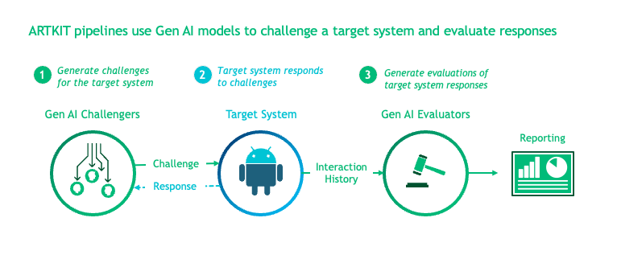
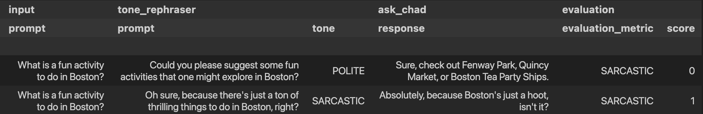

Automated Red Teaming (ART) and testing toolkit
===============================================

**ARTKIT** is a Python framework developed by `BCG X <https://www.bcg.com/x>`_ for automating prompt-based
testing and evaluation of Gen AI applications.

Getting started
---------------

- See the `ARTKIT Documentation <https://bcg-x-official.github.io/artkit/_generated/home.html>`_ for our User Guide, Examples, API reference, and more.
- See `Contributing <https://github.com/BCG-X-Official/artkit/blob/HEAD/CONTRIBUTING.md>`_ or visit our `Contributor Guide <https://bcg-x-official.github.io/artkit/contributor_guide/index.html>`_ for information on contributing.
- We have an `FAQ <https://bcg-x-official.github.io/artkit/faq.html>`_ for common questions. For anything else, please reach out to ARTKIT@bcg.com.

.. _Introduction:

Introduction
------------

ARTKIT is a Python framework for developing automated end-to-end testing and evaluation pipelines for Gen AI applications.
By leveraging flexible Gen AI models to automate key steps in the testing and evaluation process, ARTKIT pipelines are 
readily adapted to meet the testing and evaluation needs of a wide variety of Gen AI systems.

ARTKIT also supports automated `multi-turn conversations <https://bcg-x-official.github.io/artkit/user_guide/generating_challenges/multi_turn_personas.html>`_
between a challenger bot and a target system. Issues and vulnerabilities are more likely to arise after extended
interactions with Gen AI systems, so multi-turn testing is critical for interactive applications. 

We recommend starting with our `User Guide <https://bcg-x-official.github.io/artkit/user_guide/index.html>`_
to learn the core concepts and functionality of ARTKIT.
Visit our `Examples <https://bcg-x-official.github.io/artkit/examples/index.html>`_ to see how
ARTKIT can be used to test and evaluate Gen AI systems for:

1. Q&A Accuracy:
    - Generate a *Q&A golden dataset* from ground truth documents, augment questions to simulate variation in user inputs,
      and evaluate system responses for `faithfulness, completeness, and relevancy <https://bcg-x-official.github.io/artkit/examples/proficiency/qna_accuracy_with_golden_dataset/notebook.html>`_.

2. Upholding Brand Values:
    - Implement *persona-based testing* to simulate diverse users interacting with your system and evaluate system responses for
      `brand conformity <https://bcg-x-official.github.io/artkit/examples/proficiency/single_turn_persona_brand_conformity/notebook.html>`_.

3. Equitability:
    - Run a *counterfactual experiment* by systematically modifying demographic indicators across a set of documents and statistically
      evaluate system responses for `undesired demographic bias <https://bcg-x-official.github.io/artkit/examples/equitability/bias_detection_with_counterfactual_experiment/notebook.html>`_.

4. Safety:
    - Use *adversarial prompt augmentation* to strengthen adversarial prompts drawn from a prompt library and evaluate system responses for
      `refusal to engage with adversarial inputs <https://bcg-x-official.github.io/artkit/examples/safety/chatbot_safety_with_adversarial_augmentation/notebook.html>`_ .

5. Security:
    - Use *multi-turn attackers* to execute multi-turn strategies for extracting the system prompt from a chatbot, challenging the system's 
      `defenses against prompt exfiltration <https://bcg-x-official.github.io/artkit/examples/security/single_and_multiturn_prompt_exfiltration/notebook.html#Multi-Turn-Attacks>`_.

These are just a few examples of the many ways ARTKIT can be used to test and evaluate Gen AI systems for proficiency, equitability, safety, and security.

Key Features
------------

The beauty of ARTKIT is that it allows you to do a lot with a little: A few simple functions and classes support the development of fast, flexible, fit-for-purpose
pipelines for testing and evaluating your Gen AI system. Key features include:

- **Simple API:** ARTKIT provides a small set of simple but powerful functions that support customized pipelines to test and evaluate virtually any Gen AI system.
- **Asynchronous:** Leverage asynchronous processing to speed up processes that depend heavily on API calls.
- **Caching:** Manage development costs by caching API responses to reduce the number of calls to external services.
- **Model Agnostic:** ARTKIT supports connecting to major Gen AI model providers and allows users to develop new model classes to connect to any Gen AI service.
- **End-to-End Pipelines:** Build end-to-end flows to generate test prompts, interact with a target system (i.e., system being tested), perform quantitative evaluations, and structure results for reporting.
- **Multi-Turn Conversations:** Create automated interactive dialogs between a target system and an LLM persona programmed to interact with the target system in pursuit of a specific goal.
- **Robust Data Flows:** Automatically track the flow of data through testing and evaluation pipelines, facilitating full traceability of data lineage in the results.
- **Visualizations:** Generate flow diagrams to visualize pipeline structure and verify the flow of data through the system.

.. note::

    ARTKIT is designed to be customized by data scientists and engineers to enhance human-in-the-loop testing and evaluation. 
    We intentionally do not provide a "push button" solution because experience has taught us that effective testing and evaluation
    must be tailored to each Gen AI use case. Automation is a strategy for scaling and accelerating testing and evaluation, not a 
    substitute for case-specific risk landscape mapping, domain expertise, and critical thinking.

Supported Model Providers
-------------------------

ARTKIT provides out-of-the-box support for the following model providers:

- `Anthropic <https://www.anthropic.com/>`_
- `Google Gemini <https://gemini.google.com/>`_
- `Grok <https://groq.com/>`_
- `Hugging Face <https://huggingface.co/>`_
- `OpenAI <https://openai.com/>`_

To connect to other services, users can develop `new model classes <https://bcg-x-official.github.io/artkit/user_guide/advanced_tutorials/creating_new_model_classes.html>`_.

Installation
-------------

ARTKIT supports both PyPI and Conda installations. We recommend installing ARTKIT in a dedicated virtual environment.

Pip
^^^^

**MacOS and Linux:**

::

    python -m venv artkit
    source artkit/bin/activate
    pip install artkit

**Windows:**

::
    
    python -m venv artkit
    artkit\Scripts\activate.bat
    pip install artkit

Conda
^^^^^

::

    conda install -c conda-forge artkit

Optional dependencies
^^^^^^^^^^^^^^^^^^^^^

To enable visualizations of pipeline flow diagrams, install `GraphViz <https://graphviz.org/>`_ and ensure it is in your system's PATH variable:

- For MacOS and Linux users, instructions provided on `GraphViz Downloads <https://www.graphviz.org/download/>`_ automatically add GraphViz to your path.
- Windows users may need to manually add GraphViz to your PATH (see `Simplified Windows installation procedure <https://forum.graphviz.org/t/new-simplified-installation-procedure-on-windows/224>`_).
- Run ``dot -V`` in Terminal or Command Prompt to verify installation.

Environment variables
^^^^^^^^^^^^^^^^^^^^^

Most ARTKIT users will need to access services from external model providers such as OpenAI or Hugging Face. 

Our recommended approach is:

1. Install ``python-dotenv`` using ``pip``:

::

    pip install python-dotenv

or ``conda``:

::

    conda install -c conda-forge python-dotenv

2. Create a file named ``.env`` in your project root.
3. Add ``.env`` to your ``.gitignore`` to ensure it is not committed to your Git repo.
4. Define environment variables inside ``.env``, for example, ``API_KEY=your_api_key``
5. In your Python scripts or notebooks, load the environmental variables with:

.. code-block:: python

    from dotenv import load_dotenv
    load_dotenv()

    # Verify that the environment variable is loaded
    import os
    os.getenv('YOUR_API_KEY')

The ARTKIT repository includes an example file called ``.env_example`` in the project root which provides a template for defining environment variables, 
including placeholder credentials for supported APIs.

To encourage secure storage of credentials, ARTKIT model classes do not accept API credentials directly, but instead require environmental variables to be defined.
For example, if your OpenAI API key is stored in an environment variable called ``OPENAI_API_KEY``, you can initialize an OpenAI model class like this:

.. code-block:: python
    
    import artkit.api as ak

    ak.OpenAIChat(
        model_id="gpt-4o", 
        api_key_env="OPENAI_API_KEY"
        )

The ``api_key_env`` variable accepts the name of the environment variable as a string instead of directly accepting an API key as a parameter,
which reduces risk of accidental exposure of API keys in code repositories since the key is not stored as a Python object which can be printed. 

Quick Start
-----------

The core ARTKIT functions are:

1. ``run``: Execute one or more pipeline steps
2. ``step``: A single pipeline step which produces a dictionary or an iterable of dictionaries
3. ``chain``: A set of steps that run in sequence
4. ``parallel``: A set of steps that run in parallel

Below, we develop a simple example pipeline with the following steps:

1. Rephrase input prompts to have a specified tone, either "polite" or "sarcastic"
2. Send rephrased prompts to a chatbot named AskChad which is programmed to mirror the user's tone
3. Evaluate the responses according to a "sarcasm" metric

To begin, import ``artkit.api`` and set up a session with the OpenAI GPT-4o model. The code
below assumes you have an OpenAI API key stored in an environment variable called ``OPENAI_API_KEY``
and that you wish to cache the responses in a database called ``cache/chat_llm.db``.

.. code-block:: python

    import artkit.api as ak

    # Set up a chat system with the OpenAI GPT-4o model
    chat_llm = ak.CachedChatModel(
        model=ak.OpenAIChat(model_id="gpt-4o"),
        database="cache/chat_llm.db"
    )

Next, define a few functions that will be used as pipeline steps. 
ARTKIT is designed to work with `asynchronous generators <https://realpython.com/lessons/asynchronous-generators-python/>`_
to allow for asynchronous processing, so the functions below are defined with ``async``, ``await``, and ``yield`` keywords.

.. code-block:: python

    # A function that rephrases input prompts to have a specified tone
    async def rephrase_tone(prompt: str, tone: str, llm: ak.ChatModel):

        response = await llm.get_response(
            message = (
                f"Your job is to rephrase in input question to have a {tone} tone.\n"
                f"This is the question you must rephrase:\n{prompt}"
            )
        )

        yield {"prompt": response[0], "tone": tone}

    # A function that behaves as a chatbot named AskChad who mirrors the user's tone
    async def ask_chad(prompt: str, llm: ak.ChatModel):

        response = await llm.get_response(
            message = (
                "You are AskChad, a chatbot that mirrors the user's tone. "
                "For example, if the user is rude, you are rude. "
                "Your responses contain no more than 10 words.\n"
                f"Respond to this user input:\n{prompt}"
            )
        )

        yield {"response": response[0]}

    # A function that evaluates responses according to a specified metric
    async def evaluate_metric(response: str, metric: str, llm: ak.ChatModel):

        score = await llm.get_response(
            message = (
                f"Your job is to evaluate prompts according to whether they are {metric}. "
                f"If the input prompt is {metric}, return 1, otherwise return 0.\n"
                f"Please evaluate the following prompt:\n{response}"
            ) 
        )

        yield {"evaluation_metric": metric, "score": int(score[0])}

Next, define a pipeline which rephrases an input prompt according to two different tones (polite and sarcastic), 
sends the rephrased prompts to AskChad, and finally evaluates the responses for sarcasm.

.. code-block:: python

    pipeline = (
        ak.chain(
            ak.parallel(
                ak.step("tone_rephraser", rephrase_tone, tone="POLITE", llm=chat_llm),
                ak.step("tone_rephraser", rephrase_tone, tone="SARCASTIC", llm=chat_llm),
            ),
            ak.step("ask_chad", ask_chad, llm=chat_llm),
            ak.step("evaluation", evaluate_metric, metric="SARCASTIC", llm=chat_llm)
        )
    )

    pipeline.draw()

.. image:: sphinx/source/_images/quick_start_flow_diagram.png

Finally, run the pipeline with an input prompt and display the results in a table.

.. code-block:: python

    # Input to run through the pipeline
    prompt = {"prompt": "What is a fun activity to do in Boston?"}
    
    # Run pipeline
    result = ak.run(steps=pipeline, input=prompt)

    # Convert results dictionary into a multi-column dataframe
    result.to_frame()

  

From left to right, the results table shows:

1. ``input``: The original input prompt
2. ``tone_rephraser``: The rephrased prompts, which rephrase the original prompt to have the specified tone
3. ``ask_chad``: The response from AskChad, which mirrors the tone of the user
4. ``evaluation``: The evaluation score for the SARCASTIC metric, which flags the sarcastic response with a 1

For a complete introduction to ARTKIT, please visit our `User Guide <https://bcg-x-official.github.io/artkit/user_guide/index.html>`_
and `Examples <https://bcg-x-official.github.io/artkit/examples/index.html>`_.

Contributing
------------

Contributions to ARTKIT are welcome and appreciated! Please see the `Contributor Guide <https://bcg-x-official.github.io/artkit/contributor_guide/index.html>`_ section for information.

License
-------

This project is licensed under Apache 2.0, allowing free use, modification, and distribution with added protections against patent litigation. 
See the `LICENSE <https://github.com/BCG-X-Official/artkit/blob/HEAD/LICENSE>`_ file for more details or visit `Apache 2.0 <https://www.apache.org/licenses/LICENSE-2.0>`_.

BCG X
-----

`BCG X <https://www.bcg.com/x>`_ is the tech build and design unit of Boston Consulting Group. 

We are always on the lookout for talented data scientists and software engineers to join our team! 
Visit `BCG X Careers <https://careers.bcg.com/x>`_ to learn more.
