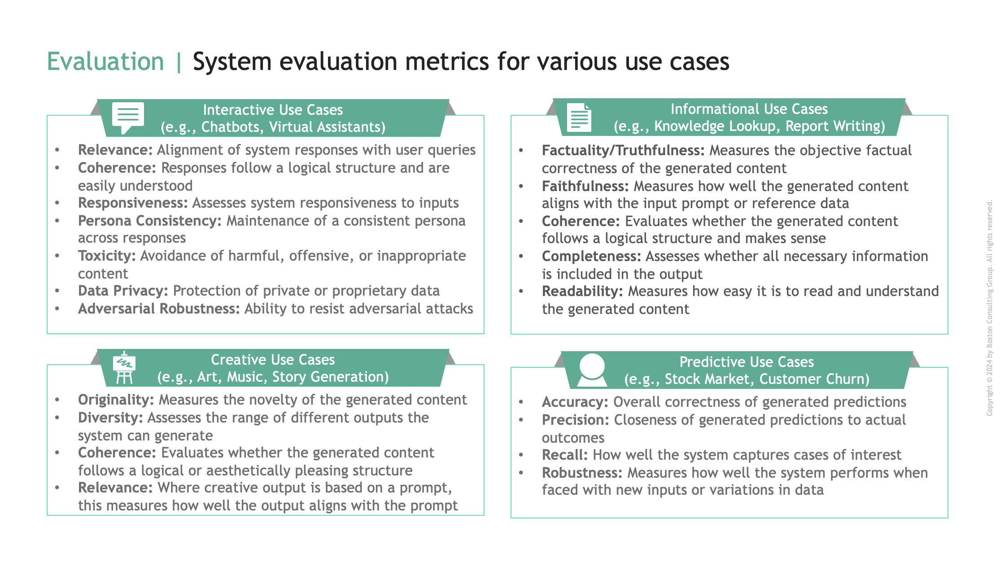
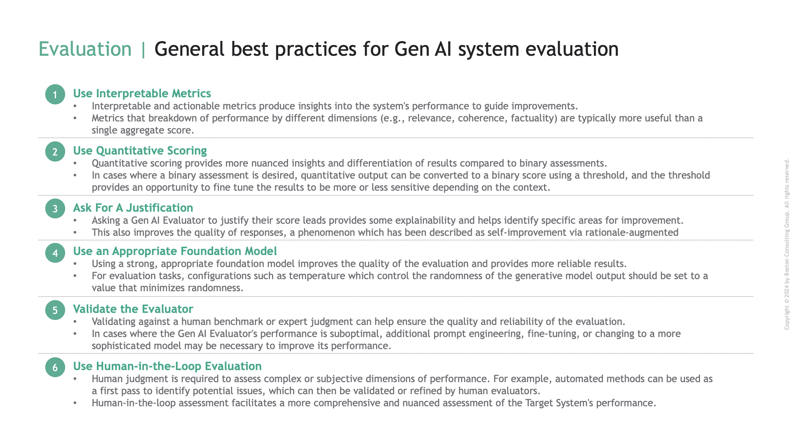

Gen AI Testing and Evaluation
=============================

Introduction
------------

As Gen AI systems become increasingly powerful and integrated into critical processes, rigorous testing and evaluation 
is paramount to ensuring they operate safely, ethically, and effectively. 

Testing and evaluating Gen AI systems requires a multifaceted approach that includes assessing a system's proficiency at its 
intended function, as well as its adherence to ethical guidelines, compliance with legal and regulatory requirements, resilience 
to adversarial attacks, and ability to handle a wide range of scenarios and inputs.

ARTKIT, the Automated Red Teaming (ART) and testing toolkit, provides a framework for automating key steps of the testing and evaluation process,
including generating test prompts, interacting with Gen AI systems, evaluating responses, and integrating these steps into robust end-to-end pipelines.
The outputs of ARTKIT pipelines can be easily integrated into reporting dashboards, enabling stakeholders to gain insights into the performance of
Gen AI systems and identify areas for improvement.

.. caution::

    Automated approaches are enhancements, not replacements, of human-driven Responsible AI testing and evaluation. Manual 
    testing, human-in-the-loop evaluation, expert review, and `critical thinking` are essential and irreplaceable components of a robust 
    testing and evaluation strategy. 

This section outlines foundational concepts needed to plan and develop automated testing and evaluation pipelines using ARTKIT, including
deciding what risks to test for, which types of tests to employ, which evaluation metrics to use, and how to best design ARTKIT pipelines 
to generate actionable insights into the performance of Gen AI systems.

.. note::
  
  Throughout the documentation, we refer to the Gen AI system being tested as the *target system*.

Automated Test & Eval
---------------------

Automated testing and evaluation of Gen AI systems involves a series of steps that can be automated with ARTKIT.
At a high level, these steps include:

1. **Target System Setup**
    - To integrate a target system into ARTKIT pipelines, it must have an endpoint that receives prompts and generates responses.
2. **Generating Challenges**
    - A *challenge* is a test prompt which is presented to the target system to elicit a response.
      They can be generated manually, sampled and/or augmented from prompt libraries, or generated *de novo* using LLMs.
3. **Evaluating Interactions**
    - Target system responses are evaluated with metrics tailored to the use case. Gen AI evaluation metrics may
      include factuality, relevance, completeness, coherence, and many other dimensions related to system performance.
4. **Reporting**
    - Evaluation results must be presented in a structured way to provide insights into target system performance and
      specific areas for improvement.

ARTKIT supports combining these steps into end-to-end pipelines that automate the testing and evaluation process, allowing for rapid, scalable,
and repeatable assessment of Gen AI systems. 

Before diving into each of these steps, it is important to establish what you are testing for, as this dictates the types of challenges,
evaluation metrics, and reporting mechanisms that are applicable for your use case. The process of identifying and prioritizing risks is known
as *risk landscape mapping*.

Risk Landscape Mapping
----------------------

The question of which risks to test for is a critical starting point for every project. It determines the scope, depth, and focus of the 
testing and evaluation process. At a high level, risk landscape mapping begins with four key questions:

.. image:: ../../_images/risk_landscape.png
   :alt: Risk Landscape Key Questions
   :width: 800px
   :align: center

It is impossible to provide a comprehensive list of all the factors that should be considered when testing a Gen AI system, but the following
considerations provide a starting point for developing a strategy for testing and evaluating your Gen AI use case:

1. **Use Case and Intended Functionality**
    - What is the primary use case of the target system? What tasks or functions is it designed to perform?
      What are the key performance indicators (KPIs) that define success for the target system?
2. **Persona and Interactivity**
    - What "persona" should the system embody? How should the system handle unexpected inputs, out-of-scope requests, user feedback,
      corrections, emotional cues, or other forms of user interaction?
3. **Robustness and Generalization**
    - What variations in input data could the target system encounter in real-world scenarios? For example, is the system likely to
      encounter user errors, multiple languages, noisy data, or other perturbations?
4. **Adversarial Resilience**
    - What types of adversarial attacks or manipulations could the target system be exposed to? For example, is the system likely to
      encounter hackers, trolls, or other malicious actors?
5. **Safety**
    - What types of harmful outputs could be unintentionally generated by the target system? For example, could the system produce misinformation,
      offensive content, or other harmful outputs in the course of normal user interactions?
6. **Fairness and Bias**
    - Is there potential for the system to exhibit bias or unfairness in its outputs? How is fairness defined and measured in the context of the
      target system?
7. **Explainability**
    - Is it important for users to understand how the target system arrived at its conclusions? How explainable are its decisions or outputs?
    - Asking a Gen AI Evaluator to justify their evaluation can provide valuable insights into the decision-making process and help identify
      areas for improvement. In addition, asking Gen AI models to provide a justification for their response can improve the quality of the
      response, a phenomenon which has been described as `self-improvement via rationale-augmented answers <https://arxiv.org/abs/2210.11610>`_.
8. **Performance Benchmarks and Baselines**
    - Are there existing performance benchmarks or baselines for the target system? How does the system compare to state-of-the-art models or
      human performance?
9. **Ethical and Legal Considerations**
    - Are there ethical guidelines, legal requirements, or regulatory constraints that the target system must adhere to? For example, are there
      restrictions on the use of personal data, limitations on the content that can be generated, or requirements for transparency or fairness?

By considering these factors, you can develop a comprehensive testing and evaluation strategy that covers a wide range of dimensions related to the
performance, safety, security, and usability of the target system. This strategy can then guide the selection of appropriate testing paradigms, evaluation
metrics, and reporting mechanisms to assess the system's performance across these dimensions.

Challenge Paradigms
-------------------

There are several major paradigms for challenging a target system that differ in their structure, goals, and complexity. A given use case may require a combination of
these challenge paradigms to comprehensively test the target system's performance:

.. image:: ../../_images/testing_paradigms.png
   :alt: Testing Paradigms
   :width: 800px
   :align: center

A given paradigm may be more or less relevant depending on the use case and risk profile of the target system. As discussed in the next section,
the paradigm also influences which evaluation metrics are applicable. 

Evaluation
----------

Evaluating the performance of Gen AI systems requires careful consideration of the risk landscape and the types of challenges being employed. Below,
we highlight key evaluation metrics that may be relevant for different types of Gen AI use cases, as well as best practices for developing evaluation
pipelines that provide valid and actionable insights.

Metrics
~~~~~~~

Evaluation metrics should be interpretable and actionable, providing insights into the system's performance that can guide improvements.
Compared to traditional machine learning, evaluation metrics for Gen AI systems are typically nuanced and domain-specific, reflecting the 
diverse range of tasks and capabilities that Gen AI systems are designed to perform. These more complex evaluation metrics are themselves 
enabled by Gen AI models, which are readily adapted to specific evaluation tasks through prompt engineering and/or fine-tuning.

Below is an illustrative list of evaluation metrics that may be relevant for different types of Gen AI use cases. This list is not
exhaustive and is intended to provide a starting point for developing evaluation metrics for Gen AI systems. Depending on the use case, 
additional metrics may be relevant, and existing metrics may need to be adapted or combined to suit the needs of specific use cases.

.. note::
  
  Some evaluation metrics depend only on the target system response (e.g., toxicity), while others require the challenge prompt (e.g., relevance), 
  and others a reference answer (e.g., factuality). *Fairness/Bias* assessment also requires statistical analysis of predictions
  or evaluation metrics across protected categories.

Best practices
~~~~~~~~~~~~~~

Gen AI models are highly flexible and can be adapted to a wide range of evaluation tasks by designing appropriate prompts, therefore we recommend leveraging
Gen AI models for evaluation whenever possible. When designing Gen AI evaluations, we recommend considering the following best practices:

By following best practices and tailoring evaluation metrics to the requirements of your use case, you can develop a robust, comprehensive
and insightful evaluation methodology.

Reporting
---------

Reporting is the critical final step of a testing and evaluation pipeline. ARTKIT currently does not support automated reporting, but provides a framework
for structuring pipeline outputs in a way that facilitates insightful summaries and integration into your organization's preferred reporting framework.

It is necessary to plan the structure of your final report before designing a testing and evaluation pipeline, since the desired report determines the nature 
of the insights your results will provide and should guide the development of challenges, evaluation metrics, and other components of the pipeline. The key
questions to ask yourself are: 

1. *What insights do I want to gain from the evaluation results?*
2. *What visualizations and summary metrics will facilitate these insights?*
3. *What data structure will allow me to create these visualizations and metrics?*
4. *How do I design my ARTKIT pipeline to produce outputs in this data structure?*

Working backwards from the desired output will help you to design pipelines that effectively identify
patterns, trends, and outliers in the target system's performance. For example, a summary that aggregates performance across...

* **... different challenge categories and evaluation metrics** can help identify *which categories of inputs are most likely to cause issues for specific evaluation dimensions*.
* **... different goals and approaches of persona-generated challenges** can help identify *which users and interaction approaches are most likely to cause issues*.
* **... different types of augmentations** can help identify *which input styles or perturbations are most likely to cause issues*.
* **... different protected categories** can help identify *whether the system's outputs are biased with respect to different groups*.

By designing pipelines with the final report in mind, you can ensure the results are meaningful, actionable, and insightful.

Future versions of ARTKIT may support automated reporting, but for now, users are encouraged to visit the `Examples <../../examples/index.html>`_ section for realistic 
examples of how to use ARTKIT to design and implement insightful testing and evaluation pipelines.
